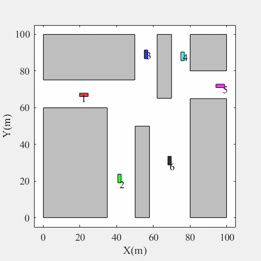

Achieving safe and efficient navigation for multi-UGV systems in highly coupled environments remains a critical challenge due to the exponential growth of collision avoidance constraints. To address the dilemma between computational efficiency and global optimality, this paper proposes a novel hybrid collaborative motion planning framework for multi-UGVs. First, a kinematics-aware global path planner integrating an offline motion primitive library and a synergistic acceleration mechanism efficiently extracts collision-free reference paths, effectively overcoming the exponential growth in computational complexity. Subsequently, a spatio-temporal velocity coordination strategy based on Conflict Zones is designed, which utilizes spatial discretization and the LSE smooth approximation to eliminate logical variables, transforming the combinatorial optimization into a smooth NLP problem. Finally, a distributed local motion planning architecture based on convex space decoupling is formulated. Leveraging the Minkowski difference and hyperplane separation theorem, strongly coupled inter-UGV collision constraints are rigorously hard-decoupled, enabling an improved SQP solver to achieve millisecond-level real-time responses. Comprehensive simulations and physical experiments demonstrate that the global layers guarantee collision-free spatio-temporal guidance, while the local distributed planner significantly reduces computational overhead, maintaining a stable replanning rate exceeding 20 Hz on resource-constrained embedded processors. This highlights the remarkable superiority and practical viability of the proposed hybrid framework in complex engineering scenarios.

## Random Obstacle Scenario

  

